## Heart Disease Predictions using Machine Learning 

In this research was used a data which classified if patients have heart disease or not according to features in it. To make predictions were used different classification techniques for predicting the risk level of each person based on age, gender, blood pressure, cholesterol, pulse rate. The disease prediction system based on predictive modeling which predicts the disease of the user on the basis of the symptoms that user provides as an input to the system. The system analyzes the symptoms provided by the user as input and gives the probability of the disease as an output. The predictions are made using the classification model that is built from the classification algorithms when the heart disease dataset is used for training. This final model can be used for prediction of any types of heart diseases. Disease prediction is done by implementing five techniques such as Logistic Regression, KNeighborsClassifier, Random Forest Classification, Grid Search, PyTorch. These techniques calculate the probability of the disease. 

# The data
- Dataset was found on kaggle https://www.kaggle.com/ronitf/heart-disease-uci
- The database contains 76 attributes, but all published experiments refer to using a subset of 14 of them. 
In particular, the Cleveland database (https://archive.ics.uci.edu/ml/datasets/Heart+Disease) is the only one that has been used by ML researchers to this date.

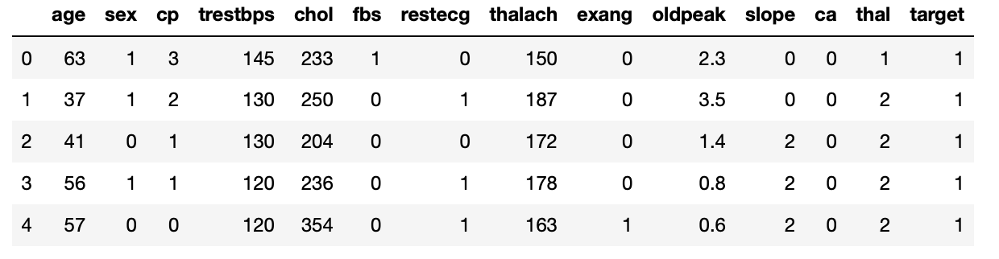

# Attribute Information:
1. Age - years
2. Sex - 1 = male, 0 = female
3. Cp - chest pain type (4 values)
4. Trestbps - resting blood pressure (in mm Hg on admission to the hospital)
5. Chol - serum cholestoral in mg/dl
6. Fbs - fasting blood sugar > 120 mg/dl (1 = true, 0 = false)
7. Restecg - resting electrocardiographic results (values 0,1,2)
8. Thalach - maximum heart rate achieved
9. Exang - exercise induced angina (1 = yes, 0 = no)
10. Oldpeak - ST depression induced by exercise relative to rest
11. Slope - the slope of the peak exercise ST segment
12. Ca - number of major vessels (0-3) colored by flourosopy
13. Thal - 0 = normal; 1 = fixed defect; 2 = reversable defect
14. Target - refers to the presence of heart disease in the patient (0 = no disease, 1 = disease)

# Techniques used:
- Exploratory Data Analysis
- Logistic Regression
- KNeighborsClassifier and Confusion Matrix
- Random Forest Classification
- Grid Search
- PyTorch

# Analysis

- Percentage of patients with or without disease
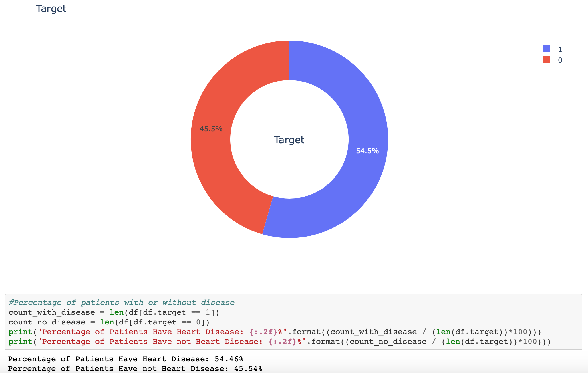

- Percentage of male/female patients
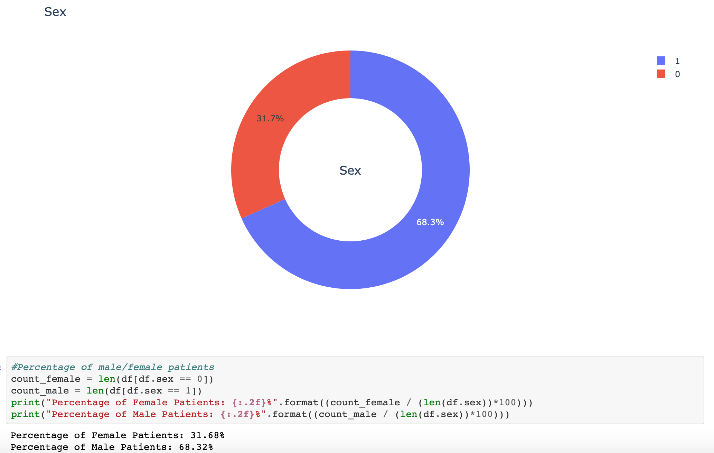

- Boxplot based on male/female patients and target (0 = no disease, 1 = disease)
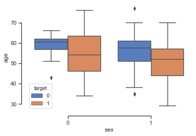

- Target group based on age
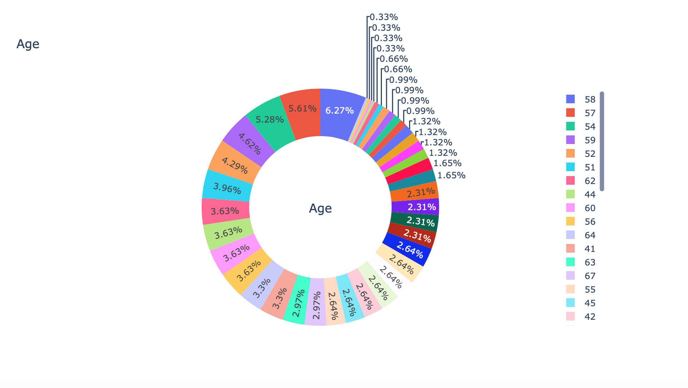

- Heart Disease Frequency for Ages
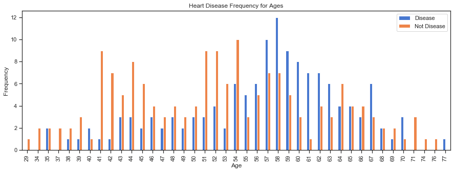

- Age vs Max Heart Disease Rate 
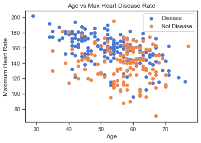

- Heart Disease Frequency for Male/Female Patients
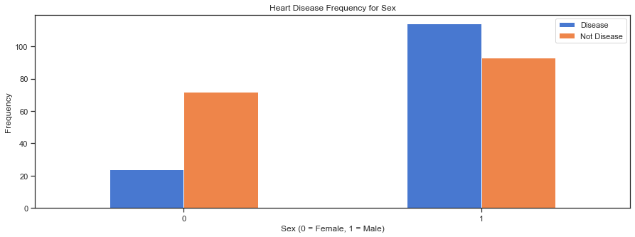

- Cholesterol vs Blood Pressure
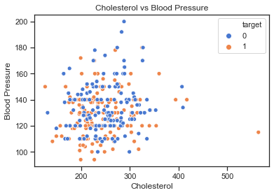 

- Thalassemia vs Max Heart Rate Achieved 

- Heart Disease Frequency According to Fasting Blood Sugar (FBS)
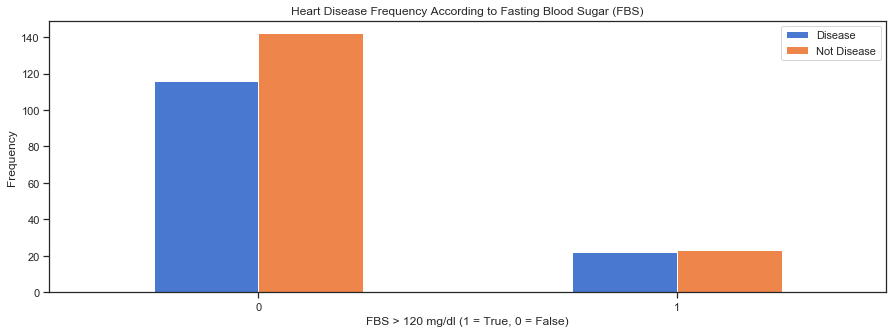

- Heart Disease Frequency According to Chest Pain Type
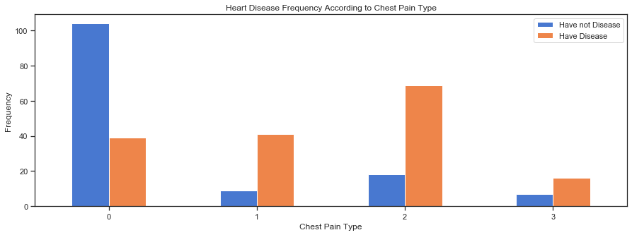
